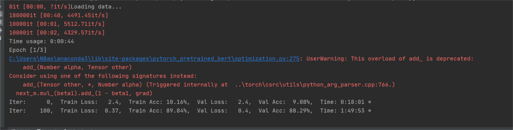

# 数据挖掘 - 面向数据安全治理的数据内容智能发现与分级分类

## 一、数据预处理

### treat1.py

在`labeled_data.csv`中找出包含关键词(label)，且标注正确的样本。

```
class_label
家居    0.460
房产    0.116
教育    0.761
时尚    0.388
时政    0.003
科技    0.110
财经    0.051
Name: in_list, dtype: float64
```

### treat2.py

在`labeled_data.csv`中筛选出包含关键词，且标注正确的样本中，仅包含当前关键词的样本。

```
  class_label  recall  precision     ratio
0          家居     460        210  0.456522
1          房产     116         69  0.594828
2          教育     761        530  0.696452
3          时尚     388        359  0.925258
4          时政       3          1  0.333333
5          科技     110         97  0.881818
6          财经      51         38  0.745098
```

### treat3.py

在`unlabeled_data.csv`中找出有且仅有一个关键词的样本，将其打上对应标签。

```
教育    2521
游戏    2338
科技    1600
时尚    1443
体育     788
家居     761
娱乐     554
房产     299
财经     162
时政       9
Name: class_label, dtype: int64
```

这里打上的标签不一定准确，根据treat2得到的结果，推测打上的标签大致准确，可以用作训练集。

对于游戏、体育、娱乐三个关键词，在`labeled_data.csv`中没有对应的数据，因此只能在`unlabeled_data.csv`中取得相关数据。(baseline关键思路)

### 如何更好地利用unlabeled数据？

目前我的想法是这样的，可以在labeled数据中找出每一种标签对应的所有文本中，出现频率较高的词汇。可以根据这些词汇在unlabeled的每个数据中的出现频率，对这个数据进行分类并打标处理，从而进一步对unlabeled中的更多数据打标，从而得到更多的训练数据。这部分我暂时还没有做，不过应该不是很复杂，如果觉得没问题的话，我就可以做这样一个工作。

czy同学提到过，可以对数据中的第一句话进特殊处理，因为文段中的第一句话通常会更可能是中心句，对文段所属分类的判断可能会起到更多作用。我认为这是一个可以尝试的点，实现方式也可以有很多（比如提取出每一个数据的第一句话单独训练一个模型再将两个模型融合起来？）。置于此，以待后期尝试。

## 二、训练模型

我在github上找到了一份代码，其所实现的功能与我们需要做的几乎一致。

https://github.com/649453932/Bert-Chinese-Text-Classification-Pytorch

这是一份基于pytorch的中文文本分类模型，支持bert模型和ERNIE模型。这个模型的训练集是20万个新闻标题，其功能是将新闻标题进行分类。具体的类别与我们的比赛所需的类别是完全一样的，可谓重合度很高。我想如果我们暂时无法自行搭建模型的话，可以尝试使用这份代码并进行修改，从而适应我们的需求。

11月12日晚，我尝试在我没有gpu的电脑上，用i5-5200U的cpu，跑了这份代码4个多小时，虽然连一个epoch都没有跑完，但是看上去效果还是很好的。



我也尝试了在体系结构课建磊老师提供的服务器上跑这个代码，没有的python库都可以安装，但是最后出的问题是缺少c++动态链接库，解决这个问题需要sudo权限，遂放弃。

如果有时间的话，你们可以尝试跑一下这个代码，如果可以跑通的话可以再尝试改一改这份代码，看能不能让这份代码跑我们的数据。如果可以用这个模型跑我们的数据的话，我觉得我们的比赛就已经成功一半了。

加油~

## 11.15

添加了treat4.py，用于将数据按照github上的训练模型的输入要求进行了处理。
对github上的bert模型进行了微调，使之适应我们的数据。因此，现在可以尝试一下直接用github上的模型跑我们的数据会是什么样的效果。

训练前需要做的工作：
1. 运行`treat4.py`，将训练模型所需的输入文件生成到`Model/Formatted/data`文件夹中。
2. 将那个巨大的`pytorch_model.bin`放到`Model/bert_pretain`中。由于那个文件太大，且是一个固定的文件，所以没上传到我们的仓库，否则pull的时候还要下载400多MB。
3. 确保`Model/Formatted`目录下有子目录`saved_dict`，否则训练结束后将无法保存，报错为`no such file or directory`。

`bert.py`中有一个超参数`pad_size`，我目前对它的理解是只取文本的前`pad_size`个汉字，但我不确定是否是这样。运行模型时感觉应该尝试修改这个值，使之配合我们的数据。
